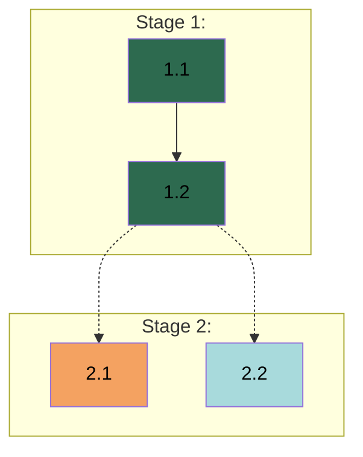

# APM {VERSION} - Work Breakdown Guide

## 1. Overview

**Reading Agent:** Planner

This guide defines the process for Work Breakdown, which transforms gathered context into planning documents (Spec, Plan, and Rules) through visible reasoning - presenting analysis in chat for the User to review before committing to files.

### 1.1 Outputs

- *Spec:* Design decisions and constraints that define what is being built. Free-form structure determined by project needs.
- *Plan:* Stage and Task breakdown with Worker assignments, validation criteria, dependency chains, and Dependency Graph.
- *`{RULES_FILE}`:* Universal execution-level Rules applied during Task execution.

All context gathered during Context Gathering must be captured across these three artifacts. If you omit gathered context from all three, justify why it is not needed for execution - the Manager and Workers operate from these documents alone. How context maps to each document is governed by §2.1 Workflow Context. Decomposition granularity adapts to project size and complexity - smaller projects warrant lighter breakdown, larger projects may need more detail.

---

## 2. Operational Standards

### 2.1 Workflow Context

From Context Gathering's §2.1 Workflow Context, you know these documents serve different audiences and that the Manager handles all coordination at runtime. Workers should not be aware of the Spec, Plan, Tracker, or Index - they see only their Task Prompt, Rules, and what they accumulate during execution. Content reaches Workers only through the Manager's extraction into Task Prompts, so your placement decisions here determine what Workers eventually work with. This section deepens that awareness into the placement decisions you make during decomposition.

**How the Spec is used:** The Manager reads the Spec and extracts relevant content per-Task into self-contained Task Prompts for Workers. Design decisions should be at the level the Manager needs for extraction - not implementation mechanics.

**How the Plan is used:** The Manager uses the Plan for coordination and Task Prompt construction. Task guidance provides the domain-specific substance the Manager wraps into Task Prompts. When Task guidance shares design decisions already captured in the Spec, reference the relevant Spec section rather than restating - the Manager reads both documents and integrates Spec content into Task Prompts during extraction. Task guidance adds what the Spec does not cover (domain-specific implementation context, constraints, and patterns). The Manager enriches Task Prompts at runtime with workspace context, findings from completed work, and cross-domain coordination notes. Task guidance provides what planning can determine; the Manager adds what only runtime reveals.

**How Rules are used:** Rules are the only planning-time document Workers read directly. Because Workers should not be aware of the Spec or Plan, Rules must be self-contained. Embed content directly, do not reference the Spec, Plan, or external authoritative documents by path.

**Coordination is runtime:** The Manager determines how work gets dispatched - sequencing, parallel execution, grouping - at runtime based on the Plan's structure. The Manager establishes version control conventions during the Implementation Phase. The Plan captures work structure; the Manager reads coordination opportunities from it.

**Passing notes to the Manager:** When you have observations, User preferences, or context that the Manager should be aware of but that you have no authority to act on, include them as a blockquote notes section after the document header separator per §4.1 Spec Format and §4.2 Plan Format. Spec notes cover the project environment the Manager will encounter (version control observations, workspace constraints, which codebases are live targets vs read-only references, and User preferences that affect execution). Plan notes cover what you observed about the work structure you created (why certain boundaries exist, where natural groupings or sequencing patterns are, what the critical path looks like, where convergence creates complexity, and Stage boundaries where holistic verification may be valuable). Notes are awareness for the Manager - observations and reasoning that inform judgment, not instructions about what to do.

### 2.2 Decomposition Principles

These principles apply across all decomposition levels. Adapt granularity to project size and complexity.

**Domains:** Identify logical work domains from Context Gathering. Split when domains involve different expertise or mental models. Combine when domains share tight context and dependencies. When balanced, prefer separation. Integrate User preferences.

**Stages:** Sequential milestone groupings - Stage N+1 begins after Stage N completes. Each Stage delivers coherent value. Split when work streams are unrelated or intermediate deliverables block subsequent work. Combine when separation is artificial. When balanced, prefer fewer Stages with clear milestones. When domains can work in parallel, structure that as parallel Tasks within a single Stage rather than parallel Stages.

**Tasks:** Derive from Stage objectives. Each Task produces a meaningful deliverable, scoped to one Worker's domain, with specified validation criteria. Split when a Task spans domains or bundles unrelated deliverables. Combine when micro-tasks create overhead without value. Include subagent steps for investigation or research.

**Steps:** Organize work within a Task for failure tracing. Ordered, discrete, sharing the Task's validation. If a step needs independent validation, split the Task.

**Scope boundaries:** Worker-assignable work is completable within the development environment and verifiable autonomously. User coordination involves external platforms, credentials, or validation requiring human judgment - include explicit coordination steps and note where User involvement is needed.

**Validation criteria:** Each Task specifies concrete pass/fail criteria tied to its deliverables - what to check and how. Criteria the Worker can verify autonomously (tests pass, outputs exist with correct structure, behavior matches requirements) allow autonomous iteration. Criteria requiring User involvement - judgment (design approval, content quality) or action (running external checks, confirming platform behavior) - require the Worker to pause. Most Tasks combine multiple criteria. Validation criteria are Worker-scoped - no references to other Stages, Tasks, or coordination-level gates. Workers validate their own deliverables; holistic verification beyond individual Tasks - milestone checks, acceptance gates, end-to-end validation - is the Manager's runtime responsibility. When Context Gathering surfaced observations about holistic verification needs, include them in Plan notes per §2.1 Workflow Context - the Manager acts on them at runtime, not as planned Tasks.

### 2.3 Spec Standards

The Spec defines what is being built - design decisions, constraints, and requirements that shape the deliverable. It forms the foundation the Plan builds on: every design decision captured here has corresponding Tasks in the Plan that implement it.

**Content placement:** The Spec captures project-shaping decisions - choices where alternatives existed, affecting what is being built across the project. Single-scope details belong in Task guidance; universal execution patterns belong in Rules. When a detail supports a design decision but does not change it, place the detail in Task guidance and keep the decision in the Spec.

**Source documents:** When User documents already authoritatively define requirements, reference them rather than restating - the Spec captures design decisions layered on existing requirements.

**Workspace structure:** When the workspace contains multiple repositories or codebases, capture workspace structure in the Spec - which repositories are working targets, which are read-only references, and where Workers operate.

**Extraction structure:** Structure for extraction per §2.1 Workflow Context - decisions should be locatable and separable so the Manager can extract relevant content per-Task into Task Prompts.

### 2.4 Plan Standards

The Plan defines how work is organized - Stages, Tasks, Worker assignments, dependencies, and validation criteria. The Manager uses it for coordination and progress tracking.

**Content placement:** Task-level content - objectives, deliverables, Worker assignments, validation criteria, dependencies, step-by-step guidance. Design decisions across Tasks belong in the Spec; universal execution patterns belong in Rules.

**Task self-sufficiency:** Each Task must contain enough context for a Worker to execute from a Task Prompt alone per §2.1 Workflow Context.

**Guidance and steps:** When Task guidance involves design decisions already captured in the Spec, reference the Spec section rather than restating the content. The Manager reads both documents and integrates Spec content into the Task Prompt during extraction - restating duplicates work and risks divergence. Guidance adds what the Spec does not cover (domain-specific implementation context, constraints, and patterns). Authoritative User documents follow the same principle - reference by path and section. Steps describe the Worker's sequential operations - the Manager transforms them into actionable instructions enriched with Spec content and guidance.

**Dispatch-aware structuring:** The Manager dispatches work in three modes (single Tasks, batches of sequential same-Worker Tasks grouped together, and parallel dispatch units sent to different Workers simultaneously). When assignments and Task ordering could go multiple ways, prefer arrangements that maximize dispatch opportunities - Tasks that can proceed independently, groups that chain naturally within a domain, work that can happen in parallel across domains. The Manager determines which mode to use at runtime based on the Plan's structure.

### 2.5 `{RULES_FILE}` Standards

`{RULES_FILE}` defines how work is performed - execution patterns that apply across all or most Tasks. Workers receive the entire file during Task execution, not just the APM Rules block. The block is a namespace to separate APM-managed standards from pre-existing content.

**Content placement:** Rules capture how work is performed - not what is being built. Output formats, response strings, data schemas, and interface contracts define what is being built and belong in the Spec even when multiple Workers need them. Execution patterns belong here when they apply to all or most Tasks - narrowly domain-specific patterns are better placed in Task guidance. When uncertain, prefer Task guidance - easier to promote later than to demote.

**Writing style:** All Workers read the same Rules file. Write rules so any Worker can determine whether a rule applies to its current work. Frame rules conditionally on the work being performed rather than on a specific Worker or domain - a Worker touching multiple domains should apply the right rules to each naturally.

**Pre-existing content:** When `{RULES_FILE}` already contains User standards, reference relevant pre-existing rules from the APM Rules block rather than duplicating. Do not modify pre-existing content unless the User explicitly requests it.

**Self-containedness:** Workers' working context is intentionally scoped to their Task Prompt and `{RULES_FILE}` - the Spec, Plan, and external design artifacts are omitted by design. Standards referencing those documents undermine that scoping. Embed content directly.

---

## 3. Work Breakdown Procedure

Three sequential documents (Spec, Plan, Rules), each with its own analysis, file write, and User approval gate. Complete each and wait for User approval before starting the next. Each document follows a single pass: present your analysis visibly in chat, read the target artifact file, then write. The analysis structures your reasoning for the User, the read transitions to writing mode, and the write produces the artifact.

Present analysis visibly in chat for the User to review per `{SKILL_PATH:apm-communication}` §2.2 Visible Reasoning. At each approval gate, describe what was written, what comes next if approved, and ask for review.

### 3.1 Spec Analysis

Present reasoning under the header **Spec Analysis:** addressing the aspects below. The Spec captures what is being built - not how work is decomposed. Workers, Stages, and Task structure are determined during Plan Analysis. Perform the following actions per §2.3 Spec Standards.
1. Analyze design decisions from gathered context:
   - *Design decisions.* Each explicit choice and implicit constraint embedded in requirements: what was decided, what alternatives existed, why this direction. Surface assumptions stated as facts that represent actual decisions.
   - *Source documents:* which requirements already have authoritative definitions in User documents; reference rather than duplicate.
   - *Boundary calls.* For each candidate, determine its primary location per §2.1 Workflow Context: Spec (project-level design decisions), Task guidance (Task-scoped details, single-domain constraints), or Rules (universal execution patterns). Each item belongs in one primary location.
   - *Decision relationships:* decisions that cascade, constrain, or cluster naturally together.
   - *Structure rationale:* how to organize decisions by project concerns so the Manager can extract relevant content.
   - *Workspace.* From the workspace assessment during Context Gathering, document the project environment: directory structure, working repositories, reference repositories, authoritative document locations, existing `{RULES_FILE}` content that was found.
2. Read `.apm/spec.md`, then write the full Spec per §4.1 Spec Format. Set `title` to the project name, `modified` to "Spec creation by the Planner.", and fill `## Overview` with 3-5 sentences (project type, core problem, essential scope, success criteria). Let content structure follow the decisions identified.
3. Pause for User review:
   - State the Spec is complete and the artifact is created.
   - Ask User to review for accuracy.
   - If modifications needed, apply and repeat step 3.
   - If approved, proceed to §3.2 Plan Analysis.

### 3.2 Plan Analysis

Present reasoning under the header **Plan Analysis:** with sub-headers **Domain Analysis:**, **Stage Structure:**, **Stage N:** for each Stage, and **Dependency Analysis:**. Each section derives from the previous - domains inform Stage structure, Stage objectives decompose into Tasks. Perform the following actions per §2.4 Plan Standards.
1. Analyze work structure from gathered context and the approved Spec per §2.2 Decomposition Principles:
   - *Domain Analysis.* Grounded in the Spec approved above:
     - Logical work domains and their scope.
     - Why domains are separated or combined.
     - How domains map to Workers with proposed names and responsibilities.
     Update Plan header Workers field.
   - *Stage Structure.* Starting from the domains identified above, reason about how the project's work sequences into Stages. Where do the domain boundaries, dependency chains, or deliverable milestones create natural progression points? Each Stage is a sequential milestone grouping - Stage N+1 begins only after Stage N completes. Parallelism happens within a Stage (parallel Tasks across Workers), not across Stages. Present the sequencing rationale and what each Stage delivers before analyzing individual Stages. Update Plan header Stages field.
   - *Stage N.* For each Stage:
     - *Stage deliverables and Task mapping.* What deliverables this Stage requires to meet its milestone. How those deliverables map to Tasks: which are distinct enough to warrant separate Tasks, which are tightly coupled enough to combine into one, and which can proceed independently vs sequentially. When a deliverable spans domains, split into per-domain Tasks with cross-agent dependencies. When a deliverable is large, split into sequential Tasks that build toward it. When deliverables share tight context or dependencies, combine them to reduce coordination overhead. Present the mapping reasoning, then name the Tasks that emerge - what each one produces, and why each exists as a separate unit of work.
     - *Per-Task analysis.* For each Task:
       - *Worker assignment:* which Worker and why.
       - *Task scope:* what is the Task's scope? Is the User involved in any steps?
       - *Task guidance:* implementation context the Worker needs, including domain-specific patterns (how to structure code, existing patterns to follow), constraints (performance, security, dependencies), technical decisions (library choices, API contracts), single-domain details (validation approach, testing strategy, error handling specifics). Include context classified as Task-scoped per §3.1 Spec Analysis. For design decisions already in the Spec, reference the Spec section per §2.4 Plan Standards rather than restating, adding domain-specific context as needed.
       - *Task validation:* concrete criteria that verify the Task's deliverables - what to check and how. Note where User involvement is needed. Validation criteria co-define the Task with Guidance.
       - *Dependencies:* same-agent as `Task N.M`, cross-agent as **`Task N.M by <Agent>`** (bolded), specifying the deliverable at the boundary.
       - *Steps:* ordered operations building toward Task completion.
     Every Task aspect must be addressed - depth varies with complexity but coverage does not. Steps incorporate guidance. After each Stage, assess whether each Task represents independently validatable work per §2.2 Decomposition Principles.
   - *Dependency Analysis.* After all Stages are analyzed, verify all cross-agent dependencies are correctly identified. Cross-check agent assignments - if a dependency's producer differs from the consumer's agent, it is a cross-agent dependency. Reason through the dependency audit (list, classify, flag misclassified) and cross-agent chains (provider, consumer, agents, required deliverable). Fix any misclassified dependencies. Describe dependencies by their relationship - not by graph rendering properties. Graph formatting is applied during the write step.
   - *Pre-write checks.* Verify the analysis is complete: every Task was analyzed with all aspects covered (Worker assignment, scope, guidance, validation, dependencies, steps), workload is reasonably distributed across Workers, all cross-agent dependencies are identified, and notes for the Manager are ready per §2.1 Workflow Context. Correct issues before proceeding.
2. Read `.apm/plan.md`, then write the full Plan per §4.2 Plan Format. Set `title` to the project name (same as Spec) and `modified` to "Plan creation by the Planner." Enrich Task details from reasoning. Ensure every cross-agent dependency is bolded at write time. Include the Dependency Graph in the Plan header.
3. Pause for User review:
   - State the Plan is complete and the artifact is created. Present a summary to the User: Worker count, Stage count with names and Task counts, total Tasks, dispatch patterns.
   - Ask User to review the Plan.
   - If modifications needed, apply and repeat step 3.
   - If approved, proceed to §3.3 Rules Analysis.

### 3.3 Rules Analysis

Present reasoning under the header **Rules Analysis:** addressing the aspects below.

Perform the following actions per §2.5 `{RULES_FILE}` Standards:
1. Analyze for universal execution patterns across all planning sources:
   - **From the Spec:** execution patterns implied by design decisions, not the design content itself. Specific outputs, formats, values, and schemas defined by design decisions remain in the Spec - they reach Workers through Task Prompts.
   - **From the Plan:** patterns recurring across multiple Task guidance fields.
   - **From gathered context:** workflow preferences, conventions, or quality requirements from Context Gathering not yet captured in the Spec or the Plan. Version control conventions are excluded - the Manager handles those and appends content to Rules during the start of the Implementation Phase.
   - **Classification:** Separate patterns that apply to all or most Tasks from narrowly Task-specific ones per §2.5 `{RULES_FILE}` Standards. Most projects produce few genuinely universal rules - project-specific constraints and output specifications belong in the Spec or Task guidance even when they apply to multiple Workers.
   - **Existing standards:** what `{RULES_FILE}` already contains; reference rather than duplicate.
2. Read `{RULES_FILE}` (or confirm it does not exist), then write the APM_RULES block per §4.3 APM_RULES Block:
   - If file exists: preserve existing content outside block, append APM_RULES block.
   - If creating new: create file with APM_RULES block only.
3. Pause for User review:
   - State Rules are complete.
   - Ask User to review `{RULES_FILE}` for accuracy.
   - If modifications needed, apply and repeat step 3.
   - If approved, state Work Breakdown is complete and all planning documents are created. Proceed to `{COMMAND_PATH:apm-1-initiate-planner}` §4 Planning Phase Completion.

---

## 4. Structural Specifications

### 4.1 Spec Format

**Location:** `.apm/spec.md`

**YAML Frontmatter Schema:**
```yaml
---
title: <project name>
modified: <last modification note>
---
```

Below the frontmatter, the document starts with `# APM Spec` followed by two header sections: `## Overview` (3-5 sentences covering project type, core problem, essential scope, and success criteria) and `## Workspace` (project environment from the workspace assessment: directory structure, working repositories, reference repositories, authoritative document locations, and existing `{RULES_FILE}` content). A single horizontal rule separates the header from the design decision content below. No horizontal rules within the content sections - `##` headings provide sufficient visual separation.

- *Planner notes:* Placed immediately after the horizontal rule separator, before content sections. Use the format `> **Notes:** <prose or unordered list>`. These cover the project environment the Manager will encounter per §2.1 Workflow Context - version control observations, workspace constraints, and User preferences that affect execution.

**Content structure:** Free-form below the header. Organize into sections that reflect the project's natural structure - its domains, components, boundaries, or technical concerns. Related design decisions share a section; cross-cutting choices get their own. The Spec should read as a coherent description of what is being built and why, shaped by the project's unique requirements.

**Content rules:** Use markdown headings (`##`) to organize decision groups. Each specification must be concrete and actionable. Structure for extraction - the Manager distills relevant content into individual Task Prompts, so decisions should be locatable and separable. Reference existing User documents rather than duplicating - include file paths and specific sections so the Manager can locate source material during Task Assignment. Use tables for enumerated values, mermaid diagrams for relationships, code blocks for schemas, prose for rationale.

### 4.2 Plan Format

**Location:** `.apm/plan.md`

**YAML Frontmatter Schema:**
```yaml
---
title: <project name>
modified: <last modification note>
---
```

Below the frontmatter, the document starts with `# APM Plan` followed by the Plan header: `## Workers` (table with `| Worker | Domain | Description |`), `## Stages` (table with `| Stage | Name | Tasks | Agents |`), and `## Dependency Graph` (mermaid diagram per **Dependency Graph Format** below). A single horizontal rule separates the header from Stage sections below. No other horizontal rules in the Plan - `##` and `###` headings provide sufficient visual separation between Stages and Tasks.

- *Planner notes:* Placed immediately after the horizontal rule separator, before Stage sections. Use the format `> **Notes:** <prose or unordered list>`. These cover what you observed about the work structure per §2.1 Workflow Context - why boundaries exist, natural groupings or sequencing patterns, critical path, convergence points, and Stage boundaries where holistic verification may be valuable.

**Stage Format.** Each Stage in the Plan:
- *Header:* `## Stage N: [Name]`
- *Naming:* Stage names reflect domain(s), objectives, and main deliverables.
- *Contents:* Tasks per **Task Format**, each containing steps per **Step Format**.

**Task Format.** Each Task in the Plan:

*Header:* `### Task <N>.<M>: <Title> - <Domain> Agent`

*Contents:*
```markdown
* **Objective:** [Single-sentence Task goal.]
* **Output:** [Concrete deliverables - files, components, artifacts produced.]
* **Validation:** [Concrete pass/fail criteria. Note where User involvement is needed.]
* **Guidance:** [Technical constraints, approach specifications, references to existing patterns, User collaboration patterns.]
* **Dependencies:** [Prior Task outputs required. Use `Task N.M by <Domain> Agent, ...` format. Bold cross-agent dependencies. Use "None" when no dependencies exist.]

1. [Step description]
2. [Step description]
```

**Step Format:** Each step is a numbered instruction describing a discrete operation. Steps are sequential operations; Guidance is context and constraints that inform how those operations are performed. Keep them separate - steps reference Guidance implicitly, not by embedding it. Include clear, specific instructions that a Worker can execute directly. Reference patterns, files, or prior work when relevant. When investigation, exploration, or research is needed, include a subagent step describing purpose and scope (e.g., "Spawn a debug subagent to isolate the rendering issue" or "Spawn a research subagent to verify the current API authentication patterns").

**Dependency Graph Format:** The Dependency Graph is a mermaid diagram in the Plan header that visualizes Task dependencies, agent assignments, and execution flow. It enables the Manager to identify batch candidates, parallel dispatch opportunities, critical path bottlenecks, and coordination points.

*Graph structure:*


The graph makes dispatch patterns visible to the Manager: same-agent chains indicate batch candidates, independent cross-agent nodes indicate parallel candidates, and dotted edges mark cross-agent coordination points where one Worker's output feeds another's input.

*Node format:* `T<Stage>_<Task>["<Task ID> <Title><br/><i><Agent Name></i>"]`

*Edge rules.* Same-agent dependencies use `-->` (solid). Cross-agent dependencies use `-.->` (dotted). Only direct dependencies - do not draw transitive closure.

*Styling:* Assign each agent a consistent fill color across all its Task nodes. Apply colors via `style T<S>_<T> fill:<color>` statements after all subgraphs, ordered by Worker appearance in the Plan Workers field. Use text color #000 and select fill colors with sufficient contrast for readability.

### 4.3 APM_RULES Block

The namespace block structure for `{RULES_FILE}`:

```text
APM_RULES {

[Project-specific standards below]

} //APM_RULES
```

**Content rules:** No content outside the APM_RULES block unless explicitly requested. Use markdown headings (`##`) for categories. Each standard must be concrete and actionable. Only universal execution-level patterns - not architecture decisions, Task-specific guidance, or coordination decisions. Reference existing standards outside the block rather than duplicating.

---

## 5. Common Mistakes
- *Under-specification:* Design decisions left implicit - if it could reasonably go multiple ways, document the chosen direction.
- *Spec absorbing decomposition:* The Spec capturing how work is decomposed (Worker assignments, Task structure, Stage sequencing) instead of what is being built. Workers, Stages, and Task structure are Plan concerns - the Spec stays at the design decision level.
- *Validation as afterthought:* "Works correctly" is not a criterion. Each Task needs concrete measures - what to check, how to check it, and what the pass/fail boundary is. Vague criteria produce vague validation.
- *Misclassified dependencies:* Cross-agent dependencies not bolded, same-agent dependencies incorrectly bolded, or wrong edge types in the Dependency Graph - classify at write time by checking whether producer and consumer share the same agent.
- *Skipped approval gate:* Each document has its own analyze-write-approve cycle. The User reviews and approves each document before the next begins. Producing multiple documents without pausing, or proceeding to the next document without User approval, breaks the cycle.
- *Restating Spec content in Task guidance:* When Task guidance repeats design decisions already in the Spec, both you and the Manager maintain redundant content that can diverge. Reference the Spec section in Task guidance - the Manager reads both documents and integrates Spec content into Task Prompts during extraction.
- *Rules that reference coordination-level documents:* Workers should not be aware of the Spec, Plan, Tracker, or Index. A rule that says "per the Spec" or "as defined in the Plan" references documents the Worker has never read. Embed the content directly.
- *Misplaced notes:* Work structure observations (parallelism, dispatch patterns, decomposition rationale) belong in Plan notes, not Spec notes. Project environment observations (workspace constraints, version control patterns) belong in Spec notes, not Plan notes.
- *Notes as instructions:* Notes inform the Manager's awareness, not its actions. Observations about what exists and why, not directives about what to do.
- *Analysis presented as predetermined:* Visible reasoning in chat must show how conclusions were reached, not present them as already decided. Internal reasoning or thinking may reach conclusions first, but the visible analysis must still walk through the reasoning for the User to review.
- *Tasks presented without derivation:* Each Stage's Tasks must be visibly derived from its deliverables - which deliverables map to which Tasks and why. Presenting a Task list without this reasoning prevents the User from auditing decomposition decisions.

---

**End of Guide**
